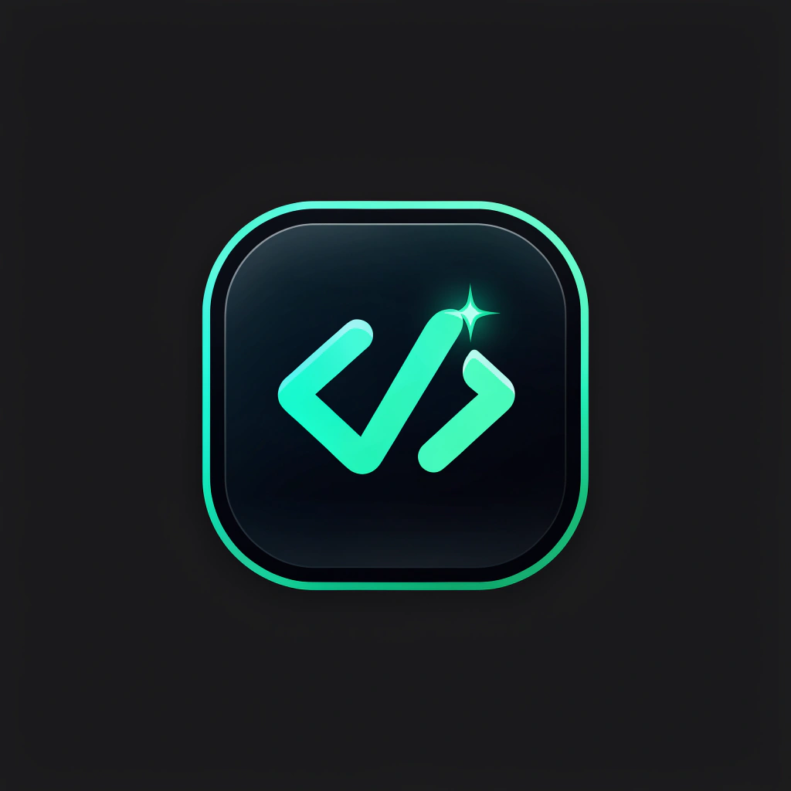

<p align="center">
  
</p>

<h1 align="center">CodeReview&nbsp;AI</h1>

<p align="center">
  <strong>AI-powered code review on your real GitHub pull requests.</strong><br />
  Sign in with GitHub, connect your repositories, and get security, logic, and
  performance analysis on open PRs — with a live dashboard, review history, and analytics.
</p>

<p align="center">
  
  
  
  
  
  
</p>

---

## Overview

**CodeReview AI** is a full‑stack web application that brings automated, AI‑driven
code review to your GitHub workflow. You authenticate with your GitHub account,
pick a repository, choose an open pull request, and the app pulls the real diff
and runs an LLM analysis that returns a risk score, a summary, and severity‑graded
inline comments (security, logic, performance, style). Every review feeds a
real‑time dashboard and analytics so you can track code‑quality trends over time.

There is **no mock data** — the dashboard, reviews, and analytics are all computed
from your actual reviews stored in the database.

## Features

- 🔐 **GitHub OAuth sign‑in** — authenticate with GitHub (NextAuth.js, JWT sessions).
- 📦 **Real repositories** — your GitHub repos are fetched live via your OAuth token.
- 🤖 **AI code review on real PRs** — fetches a pull request's actual changed files
  and runs an LLM (GPT‑4o class) to produce a summary, risk score, and inline comments.
- 🛡️ **Security scanning** — pattern‑based detection for hardcoded secrets, injection,
  XSS, and common OWASP issues, surfaced alongside AI findings.
- 📊 **Live dashboard** — total reviews, average risk score, issues found, connected
  repos, a security index, and a 30‑day review trend.
- 🗂️ **Review history** — searchable, status‑filterable list with severity breakdowns
  and a detailed per‑review view (AI summary + comments grouped by severity).
- 📈 **Analytics** — security‑score trend, issue‑category breakdown, and team stats.
- 🧩 **GitHub App integration** — server‑to‑server installation tokens for deeper repo
  access, plus an HMAC‑validated webhook mini‑service.
- 🌗 **Polished dark UI** — Tailwind + shadcn/ui, Framer Motion, emerald/teal accent.

## Tech Stack

| Layer | Technology |
|------|------------|
| Framework | Next.js 16 (App Router, Turbopack), React 19 |
| Language | TypeScript |
| Styling | Tailwind CSS 4, shadcn/ui, Framer Motion |
| Auth | NextAuth.js (GitHub OAuth) |
| Database | Prisma ORM + SQLite (dev) |
| State / Data | Zustand, TanStack Query |
| AI | `z-ai-web-dev-sdk` (GPT‑4o‑class chat completions) |
| Webhooks | Bun mini‑service (HMAC‑SHA256 validation) |
| Deploy | Docker Compose + Caddy; Kubernetes & Terraform manifests included |

## Getting Started

### Prerequisites

- **Node.js 20+** and npm
- A **GitHub account** (to create an OAuth App)

### 1. Clone & install

```bash
git clone https://github.com/VinithShetty/AI_Code_review_Assistant.git
cd AI_Code_review_Assistant
npm install
```

### 2. Create a GitHub OAuth App

Go to **GitHub → Settings → Developer settings → OAuth Apps → New OAuth App**:

- **Homepage URL:** `http://localhost:3000`
- **Authorization callback URL:** `http://localhost:3000/api/auth/callback/github`

Register it, copy the **Client ID**, and generate a **Client Secret**.

### 3. Configure environment

```bash
cp .env.example .env
```

Fill in the values (see [Environment Variables](#environment-variables) below). At
minimum you need `NEXTAUTH_SECRET`, `GITHUB_CLIENT_ID`, and `GITHUB_CLIENT_SECRET`.

```bash
# generate a strong NextAuth secret
openssl rand -base64 32
```

### 4. Set up the database

```bash
npm run db:generate   # generate the Prisma client
npm run db:push       # create the SQLite schema
```

### 5. Run the app

```bash
npm run dev
```

Open **http://localhost:3000**, click **Continue with GitHub**, connect a
repository, and run your first review.

> **Windows tip:** use `npm run dev:win` to auto‑clear a stale dev lock / port 3000.

## Environment Variables

Copy `.env.example` → `.env` and fill these in:

| Variable | Required | Description |
|----------|:--------:|-------------|
| `DATABASE_URL` | ✅ | SQLite connection string (default `file:../db/custom.db`) |
| `NEXTAUTH_URL` | ✅ | App base URL (`http://localhost:3000` in dev) |
| `NEXTAUTH_SECRET` | ✅ | Random string used to sign sessions |
| `GITHUB_CLIENT_ID` | ✅ | OAuth App Client ID |
| `GITHUB_CLIENT_SECRET` | ✅ | OAuth App Client Secret |
| `GITHUB_WEBHOOK_SECRET` | ⬜ | Secret for validating inbound GitHub webhooks |
| `GITHUB_APP_ID` / `GITHUB_APP_CLIENT_ID` | ⬜ | GitHub App identifiers (server‑to‑server access) |
| `GITHUB_APP_PRIVATE_KEY_PATH` / `GITHUB_APP_PRIVATE_KEY` | ⬜ | GitHub App private key (path or inline PEM) |
| `GITHUB_DEFAULT_INSTALLATION_ID` | ⬜ | Fallback GitHub App installation id |

> **Never commit `.env`.** It is gitignored — keep your secrets local.

## Available Scripts

| Script | Description |
|--------|-------------|
| `npm run dev` | Start the dev server on port 3000 |
| `npm run dev:win` | Dev server with Windows port/lock cleanup |
| `npm run build` | Production build |
| `npm run start` | Serve the production build |
| `npm run lint` | Run ESLint |
| `npm run db:generate` | Generate the Prisma client |
| `npm run db:push` | Sync the schema to the database |
| `npm run db:migrate` | Create & run a dev migration |
| `npm run db:reset` | Reset the database |

## How the AI Review Works

1. You sign in with GitHub and your repositories load via your OAuth token.
2. You pick a repo and choose one of its **open pull requests**.
3. The app fetches the PR's **real changed files** (unified diff) from the GitHub API.
4. The diff is sent to the LLM (`src/lib/ai-review.ts`) with a structured prompt.
5. The model returns a JSON review — summary, risk score, and per‑file comments —
   which is normalized and persisted (`Review` + `ReviewComment`) in the database.
6. The **Dashboard**, **Reviews**, and **Analytics** update from that stored data.

If the AI service is unreachable, the app stores a graceful fallback review instead
of failing, so the pipeline never hard‑errors.

## Project Structure

```
.
├── src/
│   ├── app/                # Next.js App Router — pages + API routes
│   │   ├── api/            # auth, repos, reviews, dashboard, analytics, webhooks…
│   │   └── login/          # dedicated sign-in page
│   ├── components/         # UI: layout, views, dashboard, reviews, repositories…
│   ├── lib/                # auth, prisma client, github-api, ai-review, security-scanner
│   └── stores/             # Zustand state
├── prisma/                 # schema.prisma (User, Repository, PullRequest, Review, …)
├── public/                 # static assets (logo)
├── mini-services/          # Bun webhook service
├── infrastructure/         # Docker, Kubernetes, Terraform, nginx
├── docs/                   # API / architecture / database docs
└── scripts/                # setup & utility scripts
```

## Deployment

The repository ships a root `docker-compose.yml` (single Next.js app) and a
`Caddyfile` for a reverse proxy, plus a fuller `infrastructure/` folder containing
Docker, Kubernetes, and Terraform (AWS) scaffolding for a production, multi‑service
setup. For a live deployment you'll also swap the OAuth callback URL and public URLs
to your domain and provide the production environment variables.

## Roadmap

- Persisted repo connection & per‑user data scoping
- Automatic reviews on PR webhooks (open / synchronize)
- Richer diff viewer with inline AI comments
- Postgres for production, replacing dev SQLite

## Acknowledgements

Built with [Next.js](https://nextjs.org), [Prisma](https://www.prisma.io),
[NextAuth.js](https://next-auth.js.org), [shadcn/ui](https://ui.shadcn.com), and
[Tailwind CSS](https://tailwindcss.com).

## License

This project is currently private (`"private": true` in `package.json`). Add a
`LICENSE` file if you decide to open‑source it.
